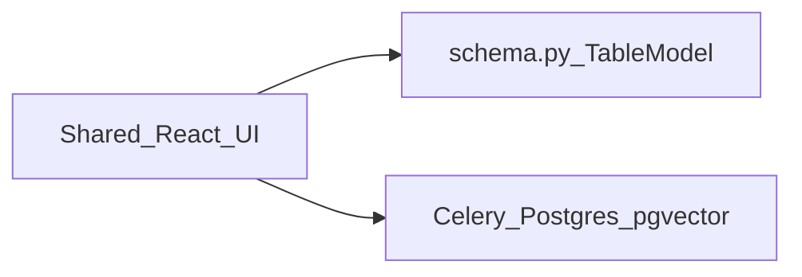

# Call Intelligence

Two backends, one product. **Pixeltable** is a `TableModel` in [`backends/pixeltable/schema.py`](backends/pixeltable/schema.py). **Reference** is Celery + Redis + Postgres + pgvector. Same React UI, same fixtures, same API surface. Upload a recording; both stacks transcribe, diarize, enrich, and index it for hybrid search.



Pixeltable: insert a row. Computed columns extract audio, run WhisperX, split speakers, call Ollama five times, and embed segments. Reference: a Celery `process_call` task plus migrations, embed repair, and Redis. Measured contrast: [compare/WHY_PIXELTABLE.md](compare/WHY_PIXELTABLE.md).

This repo is [pixeltable/sample-app-call-intelligence](https://github.com/pixeltable/sample-app-call-intelligence). Licensed under [Apache-2.0](LICENSE).

## Clone → sync → seed

**Prerequisites:** Python 3.11+, [uv](https://docs.astral.sh/uv/), Node.js 18+, Docker, and a [Hugging Face token](https://huggingface.co/settings/tokens). Accept the [pyannote/speaker-diarization-3.1](https://huggingface.co/pyannote/speaker-diarization-3.1) model terms or diarization returns 403.

Manifest videos are gitignored. Seeding runs `fetch_fixtures.py` and `prepare_fixture_media.py` first.

```bash
git clone https://github.com/pixeltable/sample-app-call-intelligence.git
cd sample-app-call-intelligence
cp .env.example .env
cp .env.example backends/reference/.env
cp .env.example backends/pixeltable/.env
# Set HF_TOKEN in both backend .env files

docker compose up -d
docker compose exec ollama ollama pull llama3.1   # compose volume; ~5 GB

uv sync
cd backends/pixeltable && uv sync && cd ../reference && uv sync && cd ../..
cd frontend && npm install && cd ..

chmod +x scripts/run_compare.sh
./scripts/run_compare.sh          # start both stacks
./scripts/run_compare.sh seed     # fetch/prepare fixtures + upload 10 sample calls
```

`PIXELTABLE_HOME=./data/pixeltable` is resolved to an absolute path from the repo root so a fresh clone does not inherit a host catalog.

`run_compare.sh` does **not** kill whatever is already on `:8000`, `:8001`, `:5173`, or `:5174`. Set `COMPARE_FORCE_PORTS=1` only if you intend to take those ports.

Open either tab — same UI, different backend.

| Tab | URL | Backend |
|-----|-----|---------|
| Reference | http://localhost:5173 | Celery + Postgres |
| Pixeltable | http://localhost:5174 | Pixeltable |

After seeding, the roster has **10 fixtures** across `call_center`, `sales`, `podcast`, and `interview` (audio and video per vertical). Video samples include dialogue and b-roll from [Pixeltable docs resources](https://github.com/pixeltable/pixeltable/tree/main/docs/resources). Processing takes a few seconds per audio call and longer for video; the roster polls until status is **completed**.

**Walkthrough**

1. Confirm KPIs and the call roster load.
2. Upload a recording or open a seeded call.
3. Click a transcript segment — the waveform or video seeks to that timestamp.
4. Search for `"billing"` or `"cancel"` and jump to the matching moment.

Stop services with `./scripts/run_compare.sh stop` (local data is kept).

## What you can do

- **Upload** audio (WAV, MP3, M4A, …) or video (MP4, MOV, MKV)
- **Monitor** KPIs, browse the roster, filter by sentiment or queue
- **Search** transcripts (keyword + semantic) and jump to the hit
- Review a call: waveform, video + transcript sync, sentiment on the timeline
- **Read** summary, action items, and QA scorecard
- **Leave coaching comments** on a segment

Coverage: [compare/FEATURE_PARITY.md](compare/FEATURE_PARITY.md). Pipeline: [compare/PIPELINE_SPEC.md](compare/PIPELINE_SPEC.md).

## Verify parity

After seeding:

```bash
uv run python scripts/compare_all.py --full
uv run python scripts/compare_assess.py
```

`compare_all.py --full` runs correctness gates (parity, search, mutations, …) plus optional concurrency / pipeline timing / recompute. Exit 0 means **gates passed**. JSON reports land in `compare/reports/` (generated; not committed).

```bash
uv run python scripts/smoke_test.py --backend both
```

Full script reference: [CONTRIBUTING.md](CONTRIBUTING.md).

## What Pixeltable gives you

Relative to the vanilla stack ([CAPABILITY_PARITY.md](compare/CAPABILITY_PARITY.md) §C / §I):

- **Declarative pipeline** — computed columns on insert instead of a Celery stage machine
- **Embedding index + `.similarity()`** — no hand-rolled pgvector migrations
- **Incremental recompute** — `recompute_columns()` / `TableModel.update_all()` without wiping transcription
- **`@pxt.query` + FastAPIRouter** — list/flagged routes from query definitions
- **Fewer moving parts** — no Redis / Celery / Alembic on the Pixeltable path

## What vanilla must build

The Reference backend implements the same product by hand ([CAPABILITY_PARITY.md](compare/CAPABILITY_PARITY.md) §D / §H):

- Celery worker + Redis + Postgres (pgvector) + Alembic
- Imperative `process_call` and status commits
- Serial LLM enrichment
- Explicit admin embed repair and filesystem delete cleanup

Code-level map: [compare/BACKEND_MAPPING.md](compare/BACKEND_MAPPING.md).

## Run one backend only

**Pixeltable:**

```bash
cd backends/pixeltable
RESET_SCHEMA=true uv run python schema.py
uv run uvicorn main:app --host 127.0.0.1 --port 8000
# separate terminal
cd frontend && VITE_API_PORT=8000 VITE_DEV_PORT=5174 VITE_BACKEND=pixeltable npm run dev
```

Do not pass `--reload`. The reloader fork races catalog apply (`ConcurrencyError`). Native embed loads `all-mpnet-base-v2` at `import schema`.

**Reference:**

```bash
docker compose up -d
cd backends/reference && uv run alembic upgrade head
uv run uvicorn app.main:app --host 127.0.0.1 --port 8001
uv run celery -A worker.celery_app worker -l info
# separate terminal
cd frontend && VITE_API_PORT=8001 VITE_DEV_PORT=5173 npm run dev
```

## Configuration

Copy [.env.example](.env.example) to the repo root and both backend directories.

| Variable | Purpose |
|----------|---------|
| `HF_TOKEN` | Hugging Face token for pyannote (required) |
| `OLLAMA_HOST` | Ollama URL (default `http://localhost:11434`) |
| `OLLAMA_MODEL` | Chat model (default `llama3.1`) |
| `EMBED_MODEL` | Sentence Transformers model (default `all-mpnet-base-v2`) |
| `PIXELTABLE_HOME` | Catalog root (relative paths resolve from the repo root) |

`./scripts/run_compare.sh` sets local data paths automatically.

## Troubleshooting

```bash
curl -s http://localhost:8001/api/health | jq   # Reference
curl -s http://localhost:8000/api/health | jq   # Pixeltable
```

- `status: ok` — dependencies are healthy
- `status: degraded` — API is up but something is missing (often an Ollama model — pull via `docker compose exec ollama ollama pull llama3.1`)

Host `ollama pull` is **not** the same as the compose service. Reset demo data with `./scripts/run_compare.sh seed`. Use **5173** / **5174** for the UI.

## Further reading

- [compare/WHY_PIXELTABLE.md](compare/WHY_PIXELTABLE.md) — L1 measured contrast
- [compare/FEATURE_PARITY.md](compare/FEATURE_PARITY.md) — UI features and API mapping
- [compare/CAPABILITY_PARITY.md](compare/CAPABILITY_PARITY.md) — platform comparison matrix
- [compare/PIPELINE_SPEC.md](compare/PIPELINE_SPEC.md) — transcription and enrichment contract
- [compare/BACKEND_MAPPING.md](compare/BACKEND_MAPPING.md) — Pixeltable ↔ Reference lifecycle
- [CONTRIBUTING.md](CONTRIBUTING.md) — repo layout, compare scripts, architecture
