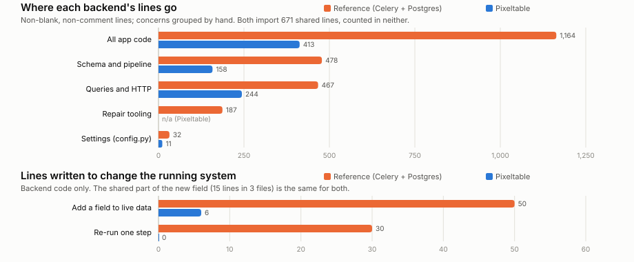
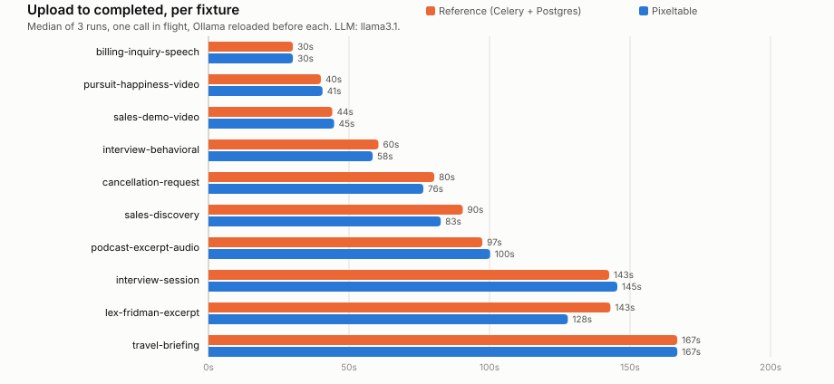
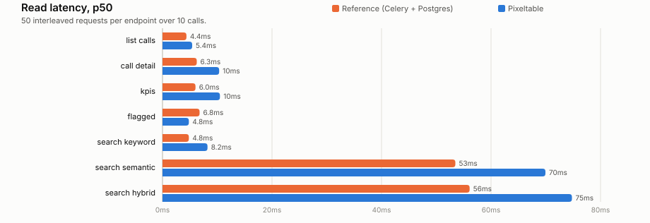

# Pixeltable showcase: call intelligence

[](https://github.com/pixeltable/showcase-call-intelligence/actions/workflows/ci.yml)
[](LICENSE)

Give a coding agent a backend it can extend without rebuilding media storage, dependency execution, derived-data maintenance, and vector indexing for each feature. This showcase implements one call-intelligence product twice. **Reference** is one implementation built with an AI coding assistant: FastAPI, Celery, Redis, Postgres with pgvector, Alembic. **Pixeltable** declares its schema, processing pipeline, queries, and HTTP routes in [`backends/pixeltable/app.py`](backends/pixeltable/app.py), with shared domain transforms in [`shared/call_center_api`](shared/call_center_api).

Both serve the same React UI and REST contract, use the same models and fixtures, and have shared parity gates. Upload a recording to extract its audio, transcribe and diarize it, derive summaries and follow-ups, search individual segments, and attach a coaching note to the evidence. The comparison makes the backend work behind an AI-generated demo inspectable: what the application owns, what Pixeltable maintains, and what still needs deployment engineering.

- **Build:** [run the first lesson](#run-the-first-lesson), then [extend one field](#extend-one-field-then-recompute-it).
- **Verify without model downloads:** [run the deterministic backend tests](#verify-the-backend-without-models).
- **Evaluate:** read the [methodology](compare/METHODOLOGY.md), [pipeline specification](compare/PIPELINE_SPEC.md), and [review with validation boundaries](docs/REVIEW.md).

The current backend targets [Pixeltable **0.7.16**](https://pypi.org/project/pixeltable/0.7.16/), the latest stable PyPI release verified on October 9, 2026. Published latency and evolution measurements below retain their original **0.7.11** environment; they are historical results, not fresh measurements of the upgraded code.

Speaker roles, sentiment, and QA scores are illustrative model outputs. Role labels use a first-speaker heuristic, and the fixtures include synthetic calls and repeated video excerpts. These fixtures validate software behavior; they do not establish ASR accuracy, diarization accuracy, or business decision quality.

## Run the first lesson

Start with one six-second billing fixture on the Pixeltable backend. The **core** profile stores the transcript and summary, indexes segments, and keeps comments anchored to source evidence. Category, action items, sentiment, and QA are **not requested** and remain null. The UI leads with the summary and evidence; optional assessments belong to the full profile. Upload metadata has editable demo defaults under a disclosure, so it remains easy to see what is fixture data.

Prerequisites for real local models: Python 3.11+ with [uv](https://docs.astral.sh/uv/), Node.js 20+, Docker, and a [Hugging Face token](https://huggingface.co/settings/tokens) with access to [pyannote/speaker-diarization-3.1](https://huggingface.co/pyannote/speaker-diarization-3.1) and its gated [segmentation-3.0](https://huggingface.co/pyannote/segmentation-3.0) dependency. Give Docker enough memory for the local model alongside your other containers; the live check below failed with a shared 8 GB VM. For a first integration check without model downloads or provider tokens, use the [deterministic tests](#verify-the-backend-without-models).

```bash
git clone https://github.com/pixeltable/showcase-call-intelligence.git && cd showcase-call-intelligence
cp .env.example .env                                  # set HF_TOKEN for real diarization
uv sync --frozen
(cd backends/pixeltable && uv sync --frozen)
(cd frontend && npm ci)
docker compose up -d ollama
docker compose exec ollama ollama pull llama3.1        # about 5 GB
./scripts/run_pixeltable.sh                           # keep this terminal open for the UI
```

In another terminal, from the repository:

```bash
./scripts/run_pixeltable.sh seed                      # add one fixture; no resets or duplicate uploads
```

Open **http://localhost:5175**. The API is on **:8002**, with its own catalog and uploads under `data/lesson/`. This path starts one Pixeltable service, one UI, and Ollama. It needs no Reference backend, Celery, Redis, or separate Postgres container. Model packages and weights are still needed for ASR and embeddings.

Press Ctrl-C in the UI terminal, then run `./scripts/run_pixeltable.sh stop` to stop the lesson service and daemon while preserving data. The shared Ollama container remains available to other applications. The launcher fixes the core profile in this dedicated catalog; the comparison launcher uses its separate full-profile catalog. Applying one profile to the other's existing tables is a schema change, not a presentation switch.

## Extend one field, then recompute it

```bash
./scripts/run_pixeltable.sh extend
```

The [runnable exercise](examples/extend_call.py) adds a billing-review business rule computed from the stored transcript, changes its expression without recomputing, then explicitly recomputes only that field. It checks that the transcript, summary, segment identifiers, and an evidence comment remain unchanged. ASR, Ollama, and embeddings are not invoked. The exercise removes its temporary field and probe comment when done, so it can be repeated without schema drift.

Start a coding agent in this repository with the [Pixeltable skill](https://github.com/pixeltable/pixeltable-skill) and [CONTRIBUTING.md](CONTRIBUTING.md). Ask it to explain the exercise, then declare a new field in `TableModel`, expose it through the shared contract, and demonstrate the same preservation checks. Keep provider calls in computed columns, segment expansion in an iterator view, and lookup in an embedding index. Inspect `pxt schema diff` before applying a schema change, and explicitly recompute changed expressions. The [pipeline map](compare/BACKEND_MAPPING.md) shows each responsibility.

## Verify the backend without models

```bash
cd backends/pixeltable
uv sync --frozen
uv run --frozen --with pytest python -m pytest tests/test_api_contract.py -q
PXT_ENRICHMENT_PROFILE=core uv run --frozen --with pytest python -m pytest tests/test_api_contract.py -q -k 'core_profile or extension'
```

This test suite creates a temporary catalog and exercises the real tables, computed-column execution, audio/video handling, segment view, vector index, API validation, comments, deletion, and model failure reporting. Deterministic substitutes replace the ASR, LLM, and embedding providers. It needs no Docker, provider tokens, or downloaded model weights, and does not touch an existing catalog. A successful run verifies backend integration; a real provider run is still a separate check.



<!-- results:code -->
| Measured from source | Reference | Pixeltable |
|---|---|---|
| App code you maintain (lines) | 1,171 | 459 |
| Files | 24 | 3 |
| Project config files: pyproject.toml, alembic.ini (lines) | 59 | 20 |
| Tables | 3 | 2 |
| Views | n/a | 1 |
| Vector indexes | 1 | 1 |
| Migration files | 3 | n/a |
| Task-queue tasks | 4 | n/a |
| Status writes in pipeline code | 11 | n/a |
| Routes with a hand-written handler | 15 | 10 |
| Routes declared from a query | n/a | 2 |
| Orchestration hops | 50 | 13 |
| Processes to run (hand-classified) | 4 | 1 |
<!-- /results:code -->

The HTTP layer is where the two are closest: both hand-write handlers for the same REST contract. Most of the difference is behind it: the Reference writes the pipeline's orchestration, a status column it updates after each stage, its schema history, wrappers around each model, and tools to repair calls the pipeline left half-done. On Pixeltable that is the table definition below. [Where the lines go](compare/WHY_PIXELTABLE.md#measured-from-source).

## Inspect the Pixeltable declarations

<!-- results:pipeline_code -->
```python
class Calls(TableModel, name="calls"):
    id = pxt.Column(type=pxt.UUID, primary_key=True)
    audio: pxt.Audio | None
    video: pxt.Video | None
    media_type: pxt.String
    call_date: pxt.Timestamp
    agent_id: pxt.String
    customer_id: pxt.String
    queue: pxt.String
    vertical: pxt.String
    original_filename: pxt.String

    extracted_audio = extract_audio(video, format="mp3")
    source_audio = f.pick_source_audio(audio, extracted_audio)
    diarized = transcribe(
        source_audio,
        model=config.WHISPERX_MODEL,
        diarize=True,
        num_speakers=2,
        diarization_model_name=config.WHISPERX_DIARIZATION_MODEL,
    )
    segments = f.extract_segments(diarized)
    transcript = f.flatten_transcript(segments)
    handle_time_sec = f.handle_time(segments)

    summary = f.parse_summary_content(transcript, ollama(f.chat_messages(vertical, transcript, "summary")))
    if config.ENRICHMENT_PROFILE == "core":
        action_items: pxt.Json | None
        sentiment: pxt.Json | None
        category: pxt.String | None
        qa_scorecard: pxt.Json | None
    else:
        action_items = f.parse_action_items_content(
            transcript, ollama(f.chat_messages(vertical, transcript, "action_items"))
        )
        sentiment = f.parse_sentiment_content(transcript, ollama(f.chat_messages(vertical, transcript, "sentiment")))
        category = f.parse_category_content(
            transcript, ollama(f.chat_messages(vertical, transcript, "category"), json=False)
        )
        qa_scorecard = f.parse_qa_content(transcript, ollama(f.chat_messages(vertical, transcript, "qa")))


class TranscriptSegments(
    TableModel,
    name="transcript_segments",
    base=Calls.where(Calls.segments != None),  # noqa: E711
    iterator=list_iterator(Calls.segments),
):
    __indexes__ = [pxt.EmbeddingIndex(text, embedding=EMBED, name="segments_embed")]  # type: ignore[name-defined]
```
<!-- /results:pipeline_code -->

`pxt schema update app.py call_center` creates the tables, and inserting a row computes every column, its segment rows and their embeddings. Pixeltable schedules the computed-column dependencies and records cell failures. The application keeps the upload and review contract; a failed cell keeps its error beside the other results.

## Optional full comparison

The comparison keeps all five enrichments and runs both implementations against the original fixtures and contract. Its source counts describe the full application, including the core lesson option; its runtime/evolution measurements remain historical 0.7.11 observations. See the [methodology](compare/METHODOLOGY.md) for fairness and device-selection limits.

```bash
(cd backends/reference && uv sync --frozen)
./scripts/run_compare.sh                              # both APIs, one worker, two UIs and all Docker services
./scripts/run_compare.sh seed                         # RESET both comparison stores; ingest all ten fixtures
```

Reference UI: **http://localhost:5173**, API **:8001**. Pixeltable comparison UI: **http://localhost:5174**, API **:8000**. This comparison uses `data/pixeltable/` and `data/reference/`, separate from the lesson. **Seeding deletes existing comparison data and uploads.** Use dedicated demo data.

## Changing the running system

Two changes and one failure, run against both backends with the ten seeded calls in place, then reverted ([`compare/evolve/`](compare/evolve/), [`scripts/bench_evolve.py`](scripts/bench_evolve.py)): add an LLM field to calls already processed, re-run only the summary after a prompt change, and recover from Ollama going down mid-call.

<!-- results:evolve -->
|  | Reference | Pixeltable |
|---|---|---|
| **Add `topics` to live data** |  |  |
| Lines written (backend) | 50 | 6 |
| Files touched (backend) | 8 | 2 |
| Operator steps | alembic upgrade head: add the column (1s)<br>restart the API and the Celery worker (9s)<br>run the backfill task over every processed call (58s) | restart the pxt daemon (shared module changed) (2s)<br>pxt schema update: add the column, backfill every row (54s)<br>pxt service update: serve the new column (11s) |
| Wall time | 68s | 67s |
| Existing calls with topics (of 10) | 10 | 10 |
| New uploads get topics | yes | yes |
| **Re-run only the summary after a prompt change** |  |  |
| Lines written (backend) | 30 | 0 |
| Operator steps | restart the API and the Celery worker (9s)<br>run the re-summarize task over every processed call (92s) | restart the pxt daemon (shared module changed) (2s)<br>pxt recompute calls summary: one LLM call per row (109s)<br>pxt service restart: new uploads use the new prompt (9s) |
| Wall time | 101s | 120s |
| Summaries changed (of 10) | 10 | 10 |
| Transcripts untouched | 10 | 10 |
| Coaching comment still anchored | yes | yes |
| **Reference without new code: re-queue `process_call`** |  |  |
| Wall time | 722s |  |
| Transcripts untouched | 0 |  |
| Coaching comment still anchored | **no** |  |
| **Recover from an LLM outage during processing** |  |  |
| State after the outage | failed, 2 segments kept | failed, 2 segments kept |
| Where the error is recorded | the call's `status` and `error_message` | `errormsg` on `action_items`, `category`, `qa_scorecard`, `sentiment`, `summary` |
| Recovery code that had to exist | 80 lines (`resume_call.py`) | 0 lines |
| Operator steps | run the resume task written for this (resume_call.py) (26s) | pxt errors: which cells failed (0s)<br>pxt recompute summary --errors-only (5s)<br>pxt recompute action_items --errors-only (2s)<br>pxt recompute sentiment --errors-only (8s)<br>pxt recompute category --errors-only (2s)<br>pxt recompute qa_scorecard --errors-only (5s) |
| Wall time | 26s | 22s |
| Completed, transcript untouched | yes | yes |
| Searchable again | yes | yes |
<!-- /results:evolve -->

## Speed

Same machine, one call in flight, backends interleaved ([`scripts/benchmark.py`](scripts/benchmark.py)).



<!-- results:pipeline -->
| Fixture (median seconds) | Reference | Pixeltable | Ref / Pxt |
|---|---|---|---|
| billing-inquiry-speech | 30.0 | 30.0 | 1.0x |
| pursuit-happiness-video | 40.0 | 40.6 | 1.0x |
| sales-demo-video | 44.1 | 44.7 | 1.0x |
| interview-behavioral | 60.5 | 58.4 | 1.0x |
| cancellation-request | 80.3 | 76.5 | 1.1x |
| sales-discovery | 90.5 | 82.7 | 1.1x |
| podcast-excerpt-audio | 97.4 | 100.2 | 1.0x |
| interview-session | 142.6 | 145.5 | 1.0x |
| lex-fridman-excerpt | 143.0 | 127.9 | 1.1x |
| travel-briefing | 166.8 | 166.8 | 1.0x |
| **All 10** | **895** | **873** | **1.0x** |

30 timed runs per backend; runs that did not complete: Reference 0, Pixeltable 0 (medians use completed runs; errors are in `benchmarks.json`).

Warm-up call (process coldness not verified): Reference 35.6s, Pixeltable 41.0s. Upload accepted in 50ms and 20ms (median).
<!-- /results:pipeline -->

Where the time goes, from the statuses the Reference commits (Pixeltable reports no stages; both run the same models):

<!-- results:stages -->
| Reference stage, median of 30 runs | Seconds | Share |
|---|---|---|
| Queued | 0.5 | 1% |
| Transcribe and diarize (WhisperX) | 25.4 | 30% |
| Five LLM enrichments | 59.3 | 70% |
| Embed segments | < 0.5 | - |
<!-- /results:stages -->



<!-- results:reads -->
| Endpoint | Reference p50 | Pixeltable p50 | Reference p95 | Pixeltable p95 |
|---|---|---|---|---|
| list calls | 4.38ms | 5.42ms | 7.15ms | 6.41ms |
| call detail | 6.26ms | 10.35ms | 8.16ms | 11.93ms |
| kpis | 6.03ms | 10.49ms | 7.83ms | 12.03ms |
| flagged | 6.78ms | 4.81ms | 8.44ms | 5.5ms |
| search keyword | 4.81ms | 8.22ms | 8.33ms | 9.97ms |
| search semantic | 53.49ms | 69.94ms | 73.47ms | 88.15ms |
| search hybrid | 56.09ms | 74.78ms | 61.84ms | 83.98ms |
<!-- /results:reads -->

Both backends make the same WhisperX and LLM calls, so most of the pipeline's time is the models'. Neither runs the five LLM calls concurrently: the Reference loops over them, and Pixeltable's built-in `ollama.chat` is a synchronous UDF, which its engine runs one at a time.

## Where the Reference is ahead

- **Progress.** It commits a status after each stage and lists a call as soon as it is uploaded. A Pixeltable row commits with all its computed columns, so until then the API says `processing` and the roster does not show the call.
- **Throughput.** Pixeltable's inserts into one table hold its lock for the whole computation and run one at a time. Celery runs as many calls as it has workers. Here both run one at a time.
- **Backfills.** The Reference's backfill task commits call by call. `pxt schema update` backfills a new column in one transaction, and one failing row rolls back the column.
- **A durable call record.** The Reference commits a `queued` row before enqueueing work, so the record survives an API restart. This does not guarantee processing resumes: its database commit and broker publish are separate, Redis persistence is not configured, and Celery uses early acknowledgement. The Pixeltable app holds an accepted upload in memory until its row commits, so a service restart in between loses the call: its id returns 404 and the upload stays on disk.
- **Reads.** Where Pixeltable's endpoints are hand-written, the Reference answers faster: building a Pixeltable query resolves the table once per selected expression. This app builds each select list once per process; semantic search, whose select list depends on the request, still pays that cost.
- **Familiarity.** Every part of it is a tool most backend engineers know.

More, and what neither has: [compare/WHY_PIXELTABLE.md](compare/WHY_PIXELTABLE.md#where-the-reference-is-ahead).

## Measure it

With both stacks up and seeded:

```bash
uv run python scripts/compare_all.py                     # parity and mutation gates
uv run python scripts/benchmark.py                       # timings
uv run python scripts/bench_evolve.py --full-reprocess   # new invocation report; re-seed afterwards
uv run python scripts/metrics.py && uv run python scripts/render_results.py
```

Every number above is written into this file by `render_results.py` from [`compare/results/`](compare/results/); CI fails if they drift. The published run:

<!-- results:environment -->
Apple M4 Pro, 14 cores, 48 GB, Darwin 26.6.1; Python 3.12.7; Pixeltable 0.7.11, WhisperX 3.8.6, torch 2.8.0; Ollama 0.31.1 serving `llama3.1` (46e0c10c039e) in Docker (4 cpus, 8307830784 bytes). Pipeline measured 2026-09-28T20:34:30+00:00, reads 2026-09-28T22:24:37+00:00, at `b37a52a` with local changes.
<!-- /results:environment -->

Timing runs write new reports under `compare/reports/benchmark/`; `--output` selects a new file and refuses existing files before provider work. Partial timing runs contain only their current measurements. Evolution runs write new reports under `compare/reports/evolve/`, with setup identity and explicit status per attempted experiment. Partial and failed runs never relabel or replace the published `evolve.json`. Publishing new results requires an intentional review of a complete compatible run.

Source counts are refreshed when code changes. Runtime measurements require a fresh full run on both stacks before making a claim about the current release. The benchmark warms whichever service processes are already running; it does not prove a cold start. It verifies Ollama cache reset and fingerprints application source to avoid combining measurements from different dirty checkouts.

## Deployment boundary

This is a local, single-tenant showcase. Docker ports bind to localhost. Before accepting external traffic, provide authentication, tenant isolation, rate and admission limits, a durable upload handoff with restart recovery, and a tested backup/restore workflow. The comparison does not validate those capabilities.

On Pixeltable, `completed` describes the stored call transforms. Semantic-index readiness is separate: a segment embedding can fail while its transcript and enrichments remain available. Inserts log failed-column diagnostics, and `pxt.get_dir_tree()` exposes recorded operation error counts; those counts are historical diagnostics, not a readiness guarantee. Search returns an explicit error when query embedding fails and omits missing vectors instead of returning unscored semantic hits. A production intake design should persist and expose search readiness, as detailed in the [review](docs/REVIEW.md).

## Troubleshooting

- `curl -s localhost:8001/api/health` and `localhost:8000/api/health` list each dependency. `degraded` usually means the Ollama model is missing: pull it with `docker compose exec ollama ollama pull llama3.1`, not a host `ollama pull`.
- LLM calls failing with `500 Internal Server Error`: Ollama's model runner can be killed for memory. The October 9 live check failed twice while loading `llama3.1` in a shared 7.74 GiB Docker VM, including a summary-only retry with no prompt cache. Increase Docker memory (12 GB is a starting allocation, not a validated minimum) or deliberately select a smaller model. Restarting or stopping unrelated containers is not part of the lesson. After fixing the runtime, recompute only failed summary cells; inspect `num_excs` and the call's status rather than relying on the recompute command's exit code. See the [live validation record](docs/validation/2026-10-09.json).
- `pxt` says the configuration changed since the daemon started: `.env` changed. `run_compare.sh` restarts the daemon; by hand, `pxt daemon restart`.
- After pulling schema changes, `./scripts/run_compare.sh seed` resets both stores.
- `run_compare.sh` gives the pxt daemon its own port (`PXT_PORT`, default 22090), because `pxt` replaces a daemon that serves another project on its port.

## Docs

- [compare/WHY_PIXELTABLE.md](compare/WHY_PIXELTABLE.md): what each side gets from its platform, and what it costs to change
- [compare/METHODOLOGY.md](compare/METHODOLOGY.md): what is measured, how, where it is tilted, and what was fixed
- [compare/CAPABILITY_PARITY.md](compare/CAPABILITY_PARITY.md): what the gates hold equal, and where the two still differ
- [compare/PIPELINE_SPEC.md](compare/PIPELINE_SPEC.md): the contract both implement
- [compare/BACKEND_MAPPING.md](compare/BACKEND_MAPPING.md): where each step lives in each backend
- [CONTRIBUTING.md](CONTRIBUTING.md): rules, layout, checks
- [docs/REVIEW.md](docs/REVIEW.md): findings, fixes, verification, and remaining deployment requirements

Licensed under [Apache-2.0](LICENSE).
