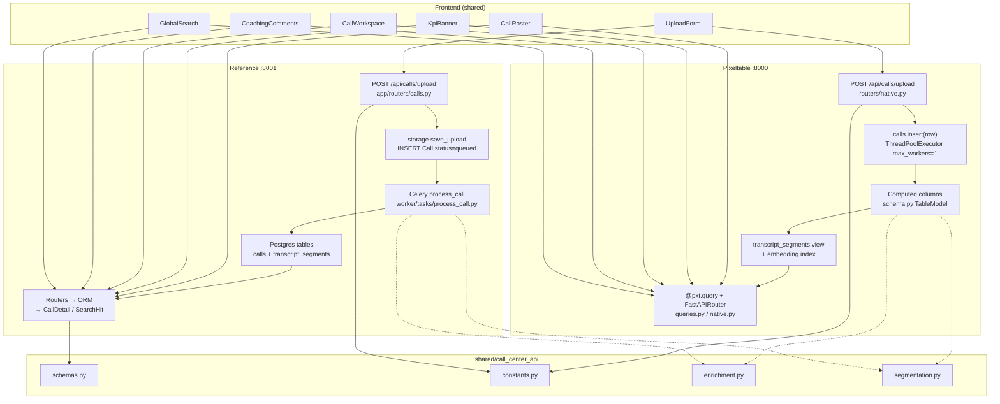
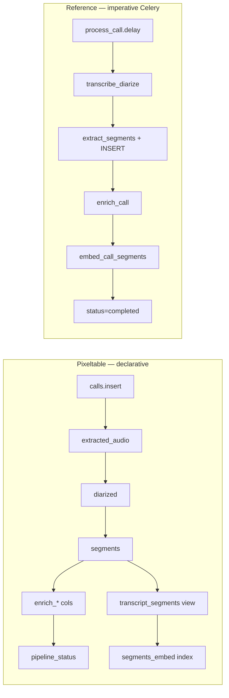

# Backend mapping — Pixeltable ↔ Reference

Side-by-side map of the full call lifecycle and every major feature. Both backends serve the same product UI; Reference uses the shared Pydantic contract in [`shared/call_center_api/schemas.py`](../shared/call_center_api/schemas.py), while Pixeltable exposes catalog-native JSON adapted in the frontend and compare scripts (see [CAPABILITY_PARITY.md §F](CAPABILITY_PARITY.md)).

Related docs: [FEATURE_PARITY.md](FEATURE_PARITY.md), [CAPABILITY_PARITY.md](CAPABILITY_PARITY.md), [PIPELINE_SPEC.md](PIPELINE_SPEC.md).

---

## End-to-end data lifecycle (A → Z)

**API shaping for Pixeltable:** UI uses [`frontend/src/api/client.pixeltable.ts`](../frontend/src/api/client.pixeltable.ts); compare scripts normalize via [`scripts/lib/pxt_api.py`](../scripts/lib/pxt_api.py) + [`pxt_api_mapping.json`](pxt_api_mapping.json).

---

## Pipeline stages A → Z

| Stage | What happens | Pixeltable | Reference |
|-------|----------------|------------|-----------|
| **A. Bootstrap** | Schema / catalog init | `main.py` imports `schema.py` (`TableModel` + `create_all`) | `app/main.py` + Alembic migrations |
| **B. Upload HTTP** | Accept multipart file + metadata | `routers/native.py:upload_call` | `app/routers/calls.py:upload_call` |
| **C. Validate** | Extension + size | `constants.ALLOWED_UPLOAD_EXTENSIONS` | Same constants, `settings.max_upload_mb` |
| **D. Persist media** | Write audio/video | Temp file → `calls.insert` (`pxt.Audio` / `pxt.Video`) | `storage.save_upload` → filesystem |
| **E. Video → audio** | Extract MP3 | Computed `extracted_audio` = `extract_audio` | `video.extract_audio_from_video` at upload |
| **F. Pick source audio** | Audio vs extracted | UDF `pick_source_audio` → `source_audio` | Uses `call.audio_path` (MP3 for video) |
| **G. Transcribe + diarize** | WhisperX + pyannote | `whisperx.transcribe` → `diarized` | `whisperx_service.transcribe_diarize` |
| **H. Label speakers** | AGENT / CUSTOMER | UDF `extract_segments` | `diarization.extract_segments` |
| **H′. Shared segmentation** | Compare contract | `shared/call_center_api/segmentation.py` | Same module |
| **I. Store segments** | One row per utterance | `segments` JSON[] → view `transcript_segments` | INSERT `TranscriptSegment` rows |
| **I′. Flatten transcript** | LLM input | UDF `flatten_transcript_segments` | `diarization.flatten_transcript` |
| **J. Handle time** | Duration | UDF `handle_time_from_segments` | `max(end_sec)` on `Call` |
| **K. LLM enrichment** | Summary, actions, sentiment, category, QA | 5× `ollama.chat` raw cols + `parse_*` / `vertical_prompt` | `OllamaClient.enrich_call` (5 serial httpx calls) |
| **K′. Prompts + parsers** | Compare contract | `verticals.py` + `enrichment.py` | Same modules |
| **L. Pipeline status** | Processing state | UDF `derive_pipeline_status` | `call.status` in `process_call` |
| **M. Embed segments** | Semantic search vectors | Native `sentence_transformer.using(..., normalize_embeddings=True)` | `embed_service.embed_text` → pgvector |
| **M′. Embed readiness** | Gate `completed` / seed wait | `GET /api/calls/{uuid}/embed-ready` | Embed before `status=completed` |
| **N. Read: list / detail** | API responses | `@pxt.query` in `queries.py` + `FastAPIRouter` | ORM + inline mapping in routers |
| **O. Search** | Keyword + semantic + hybrid | `routers/search.py` (`.contains`, `.similarity`) | `routers/search.py` (ILIKE + cosine) |
| **P. Comments** | Coaching notes | `coaching_comments` table | `coaching_comments` table |
| **Q. Delete** | Remove call | `calls.delete` + comments | Files + SQLAlchemy cascade |
| **R. Health** | Dependency checks | catalog, Ollama, pipeline | Postgres, Redis, Celery, Ollama |
| **S. Admin repair** | Re-embed / backfill | **Not implemented** | `routers/admin.py` + Celery tasks |

---

## Feature → code mapping

### User-facing features (UI + API)

| Feature | API | UI | Pixeltable | Reference |
|---------|-----|-----|------------|-----------|
| Upload | `POST /api/calls/upload` | `UploadForm` | `routers/native.py:upload_call` | `routers/calls.py:upload_call` → `process_call.delay` |
| KPIs | `GET /api/calls/kpis` | `KpiBanner` | `get_kpis` in `native.py` | `get_kpis` |
| Roster | `GET /api/calls` | `CallRoster` | `queries.list_calls` via `add_query_route` | `list_calls` → `_to_summary` |
| Search | `GET /api/search` | `GlobalSearch` | `search.py` + query helpers | `search.py:search_transcripts` |
| Detail | `GET /api/calls/{id}` | `CallWorkspace` | `queries.get_call` + thin handler | `get_call` (ORM) |
| Audio | `GET /api/calls/{id}/audio` | `WaveformPlayer` | `get_call_audio` in `native.py` | `get_call_audio` |
| Video | `GET /api/calls/{id}/video` | `VideoPlayer` | `get_call_video` in `native.py` | `get_call_video` |
| Comments | `POST /api/comments` | `CoachingComments` | `comments.py` (`call_uuid`, `segment_pos`) | `comments.py` (`call_id`, `segment_id`) |
| Flagged | `GET /api/calls/flagged` | *(no UI)* | `queries.flagged_calls` via `add_query_route` | `flagged_calls` |
| Delete | `DELETE /api/calls/{id}` | *(no UI)* | `delete_call` in `native.py` | `delete_call` + `delete_upload_files` |
| Embed ready | `GET /api/calls/{id}/embed-ready` | *(compare/seed)* | `native.py` | N/A (status gates embed) |
| Health | `GET /api/health` | `GlobalSearch` warning | `services/health.py` | `services/health.py` |

### Pipeline transforms (logic parity)

| Transform | Shared contract | Pixeltable | Reference |
|-----------|-----------------|------------|-----------|
| Extensions | `constants.ALLOWED_*` | `routers/native.py` | `storage.py` |
| Embed dim | `constants.EMBED_DIM` | HF index (768) | `models.EMBED_DIM` |
| Flagged threshold | `constants.FLAGGED_SENTIMENT_THRESHOLD` | `flagged_calls` query | `flagged_calls` |
| Speaker labeling | Shared module | `segmentation.py` → `functions.py` | `segmentation.py` → `diarization.py` |
| Enrichment prompts | `verticals.get_profile(vertical).prompts` | `vertical_prompt` UDF → `ollama.chat` system message | `OllamaClient.enrich_call(transcript, vertical)` |
| Enrichment parsers | `enrichment.parse_*` | parse UDFs in `functions.py` | `OllamaClient.enrich_call` |
| WhisperX | `PIPELINE_SPEC.md` | `schema.py` | `whisperx_service.py` |
| Ollama chat | backend-specific | built-in `ollama.chat` computed columns | `OllamaClient.chat` |
| Segment embed | backend-specific | Native `sentence_transformer` (HF, normalized) | `embed_service.embed_text` |

---

## Orchestration pattern

| Pixeltable file | Reference equivalent | Role |
|-----------------|---------------------|------|
| `schema.py` (`TableModel`) | `process_call.py` + Alembic | Defines the pipeline |
| `functions.py` | `whisperx_service.py`, `diarization.py`, `ollama_client.py`, `embed_maintenance.py` | Step implementations |
| `queries.py` + `routers/native.py` | Inline router mapping + ORM | Serving / read API |
| `frontend/.../client.pixeltable.ts` + `scripts/lib/pxt_api.py` | Shared Pydantic schemas on wire | Shape adaptation for UI / compare |
| *(none)* | `worker/celery_app.py` | Task queue |
| *(none)* | `app/routers/admin.py` | Dev embed repair |

---

## Storage & data model

| Concept | Pixeltable | Reference |
|---------|------------|-----------|
| Call ID | `calls.uuid` | `calls.id` |
| Media | Catalog blobs (`audio`, `video`, `extracted_audio`) | Filesystem paths |
| Segments | View `transcript_segments` from `list_iterator(segments)` | Table `transcript_segments` |
| Enrichment | Computed `pxt.Json` / string columns on `calls` | JSONB columns on `calls` |
| Comments | `coaching_comments` (`call_uuid`, `segment_pos`) | `coaching_comments` (`call_id`, `segment_id`) |
| Segment API IDs | Synthetic `callId:pos` (`frontend/src/lib/segmentId.ts`) | DB UUID PK |
| Vector search | Embedding index `.similarity()` | pgvector HNSW + `cosine_distance` |

---

## Shared layer

| Module | Role | Pixeltable | Reference |
|--------|------|------------|-----------|
| `schemas.py` | Reference REST contract | Health only; UI/compare adapt native JSON | All routers |
| `constants.py` | Literals (dim, extensions, threshold) | `functions.py`, `native.py` | `models.py`, `storage.py`, `calls.py` |
| `verticals.py` | LLM system prompts per vertical | `vertical_prompt` UDF | `ollama_client.py` |
| `enrichment.py` | Response parsers + empty defaults | parse UDFs in `functions.py` | `ollama_client.py` |
| `segmentation.py` | Speaker labeling + transcript flatten | `extract_segments` UDF | `diarization.py` |

---

## Intentional differences

| Area | Pixeltable | Reference |
|------|------------|-----------|
| Admin embed repair | No `/api/admin/*` | `reembed_call`, `backfill_embeddings` |
| Delete | Catalog + comments | Also removes upload files |
| Async model | Computed columns (incremental) | Celery + Redis |
| Segment PKs | Synthetic `callId:pos` | Database UUID |
| LLM parallelism | Independent computed columns | Serial `enrich_call` (see CAPABILITY_PARITY §H) |

---

## Verification scripts

| Script | Validates |
|--------|-----------|
| `shared/tests/test_enrichment.py` | Shared parsers |
| `shared/tests/test_segmentation.py` | Shared speaker labeling + flatten |
| `scripts/compare_parity.py` | Call structure, segments, audio/video streams, search shape |
| `scripts/compare_search.py` | Keyword + semantic + hybrid |
| `scripts/compare_mutations.py` | Comments + delete |
| `scripts/compare_observability.py` | Health, KPIs, flagged, statuses |
| `scripts/demo_recompute.py` | Incremental `recompute_columns('summary')` |
