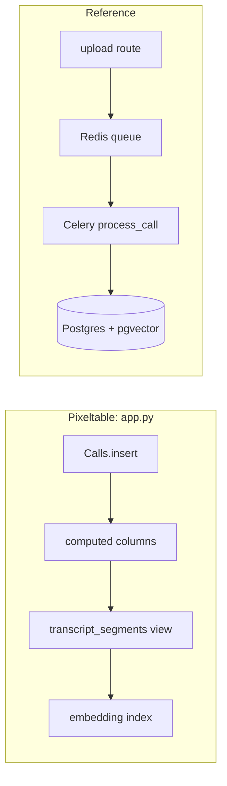

# Backend mapping

Where each step of the product lives in each backend. Line counts per file are in [`results/metrics.json`](results/metrics.json).

## The pipeline

| Step | Pixeltable ([`app.py`](../backends/pixeltable/app.py)) | Reference |
|---|---|---|
| Declare storage | `Calls`, `TranscriptSegments`, `CoachingComments` models; `pxt schema update` creates or migrates them | [`models.py`](../backends/reference/app/models.py) plus [Alembic migrations](../backends/reference/alembic/versions/) |
| Start processing | the insert itself | [`upload_call`](../backends/reference/app/routers/calls.py) enqueues [`process_call`](../backends/reference/worker/tasks/process_call.py) on Redis for a Celery worker |
| Video to audio | `extracted_audio = extract_audio(video, format="mp3")` | ffmpeg subprocess, [`video.py`](../backends/reference/app/services/video.py), called from the task |
| Transcribe and diarize | `diarized = transcribe(source_audio, ...)` (`pixeltable.functions.whisperx`) | [`whisperx_service.py`](../backends/reference/app/services/whisperx_service.py), the same steps written out, with its own model caches |
| Label speakers | `segments = f.extract_segments(diarized)` | same shared function, then one `TranscriptSegment` row per segment |
| Five enrichments | five computed columns, `chat(...)` then a parse UDF | [`OllamaClient.enrich_call`](../backends/reference/app/services/ollama_client.py): five HTTP calls in a loop |
| Progress | none: the row commits when every column is computed | a `call.status = ...` write after each stage, in each task |
| Embed segments | `__indexes__ = [pxt.EmbeddingIndex(text, embedding=...)]` on the view | [`embed_service.py`](../backends/reference/app/services/embed_service.py) plus the embed step in the task, `vector(768)` and an HNSW index in the migration |
| Failures | per cell: `errormsg`, `errortype`, `pxt errors`, `pxt recompute --errors-only` | one `status`/`error_message` per call; [`resume_call.py`](../backends/reference/worker/tasks/resume_call.py) and [`embed_maintenance.py`](../backends/reference/worker/tasks/embed_maintenance.py) repair tasks behind [`admin.py`](../backends/reference/app/routers/admin.py) |
| Re-run a step | `pxt recompute call_center/calls summary` | no path short of re-running the whole task (see [WHY_PIXELTABLE.md](WHY_PIXELTABLE.md)) |

## Serving

| Route | Pixeltable | Reference |
|---|---|---|
| `GET /api/calls`, `GET /api/calls/flagged` | declared: `api.add_query_route(query=list_calls)` / `flagged_calls` | handlers in [`calls.py`](../backends/reference/app/routers/calls.py) |
| `POST /api/calls/upload` | handler: one file field feeds the audio or the video column | handler: file to disk, row, enqueue |
| `GET /api/calls/{id}`, `/audio`, `/video`, `DELETE` | handlers (declared routes cannot take path parameters) | handlers |
| `GET /api/calls/kpis` | handler over `pxtf.count` / `pxtf.mean` | handler averaging in Python |
| `GET /api/search` | handler merging `contains()` and `.similarity()` on the view, which carries the call's columns | handler joining segments to calls, `ILIKE` and `cosine_distance` |
| `POST /api/comments`, `GET /api/comments/call/{id}` | handlers | [`comments.py`](../backends/reference/app/routers/comments.py) |
| `GET /api/health` | handler | [`health.py`](../backends/reference/app/services/health.py): Postgres, Redis, Celery, Ollama |

## What runs

| | Pixeltable | Reference |
|---|---|---|
| Processes you start | `pxt service` (the pxt daemon and its embedded Postgres come with it) | uvicorn, a Celery worker, Postgres with pgvector, Redis |
| Shared with the other backend | Ollama, the React UI, [`shared/call_center_api`](../shared/call_center_api) | same |
