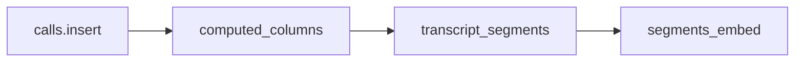

# Why Pixeltable

Same product, two backends. Claims here are **measured in this repo** (L1). No vendor pricing or FTE estimates.

## What you write

Pixeltable: one `TableModel` file — [backends/pixeltable/schema.py](../backends/pixeltable/schema.py) — plus small UDFs and `@pxt.query` routes.

Reference: Celery `process_call`, Redis, Postgres + pgvector, Alembic, embed/repair services.

Insert a row. Extract audio, WhisperX, segments, five `ollama.chat` fields, and the embedding index run as computed columns.

## What the compare suite measures

Regenerate with `uv run python scripts/compare_loc.py` and `uv run python scripts/compare_patterns.py`. Latest JSON: [reports/](reports/).

Latest `compare_loc.py`:

| Area | Reference | Pixeltable |
|------|-----------|------------|
| Pipeline (`worker` + services vs `schema.py` + UDFs) | 668 lines / 14 files | 392 lines / 2 files |
| API routers | 431 lines / 5 files | 312 lines / 4 files |
| Backend total (pipeline + routers + shared schemas) | 1978 | 1583 |

Ratio 1.25×. Semantic search is gated by `compare_search.py` (`match_type=semantic`). `compare_parity.py` needs a full 10-fixture re-seed on both backends and is not part of this check. Incremental change is `TableModel.update_all()` / `recompute_columns()` vs re-queueing the whole Celery task.

## What this is not

Not a Cloud TCO model. GPU minutes and LLM tokens still cost money on both paths. Diarization needs a Hugging Face token and acceptance of the [pyannote/speaker-diarization-3.1](https://huggingface.co/pyannote/speaker-diarization-3.1) model terms.
